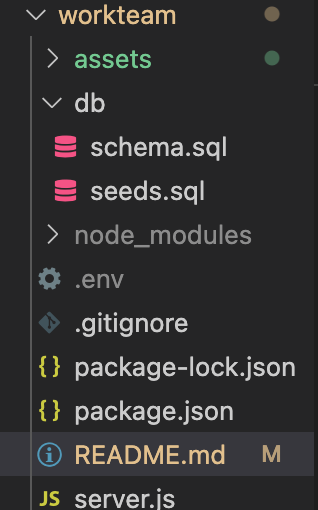

# workteam

## Description

Workteam is a commandline application that allows business owners to view their employees, manage the departments, and update roles in order to become better organized! 

  ## Table of Contents
  * [Installation](#installation)
  * [Usage](#usage)
  * [Technology](#technology)
  * [Tests](#tests)
  * [Questions](#questions)
  * [License](#license)

  ## Installation

  1. `Git clone` my repository 

  2. Your file structure should resemble the follow:

  

  3. Create a .env file at the root and input your own database information as follows:

  

  4. On the command line, in the root of the directory type `npm install`. 

  5. Make sure that package.json, package-lock.json and node_modules are all properly displaying

  6. Change the script in package.json to read: ` "start": "node server.js" `

  7. Run `npm test` and ensure a connection was established to your database as follow:

8. Cycle through the options using the `arrow keys` and manage your team!

## Usage

  

## Technology

* Inquirer package
* mysql2 package
* console.table package
* dotenv package

  
   
## Tests

  You can update the `seeds.sql` file in order to update your current employee roster, departments and salaries:
  
  

  One you are satisfied with the update information in the `seeds.sql` file, then run `mysql -u root -p` in terminal
  * run `source db/schema.sql`
  * then run `db/seeds.sql` and your database should now display your update information!

  **Please note, the about commands only work if the `schema.sql` and `seeds.sql` are inside the `db` folder!**

## Questions
  
  Hi my name is [DiSantoz](https://github.com/DiSantoz) the developer behind workteam !

  
  If you have any questions about the usage of this project or any suggestions on how to better this project please feel free to contact me at:

  dferreira91@outlook.com

## License

MIT License

Copyright (c) 2021 DiSantoz

Permission is hereby granted, free of charge, to any person obtaining a copy
of this software and associated documentation files (the "Software"), to deal
in the Software without restriction, including without limitation the rights
to use, copy, modify, merge, publish, distribute, sublicense, and/or sell
copies of the Software, and to permit persons to whom the Software is
furnished to do so, subject to the following conditions:

The above copyright notice and this permission notice shall be included in all
copies or substantial portions of the Software.

THE SOFTWARE IS PROVIDED "AS IS", WITHOUT WARRANTY OF ANY KIND, EXPRESS OR
IMPLIED, INCLUDING BUT NOT LIMITED TO THE WARRANTIES OF MERCHANTABILITY,
FITNESS FOR A PARTICULAR PURPOSE AND NONINFRINGEMENT. IN NO EVENT SHALL THE
AUTHORS OR COPYRIGHT HOLDERS BE LIABLE FOR ANY CLAIM, DAMAGES OR OTHER
LIABILITY, WHETHER IN AN ACTION OF CONTRACT, TORT OR OTHERWISE, ARISING FROM,
OUT OF OR IN CONNECTION WITH THE SOFTWARE OR THE USE OR OTHER DEALINGS IN THE
SOFTWARE.

